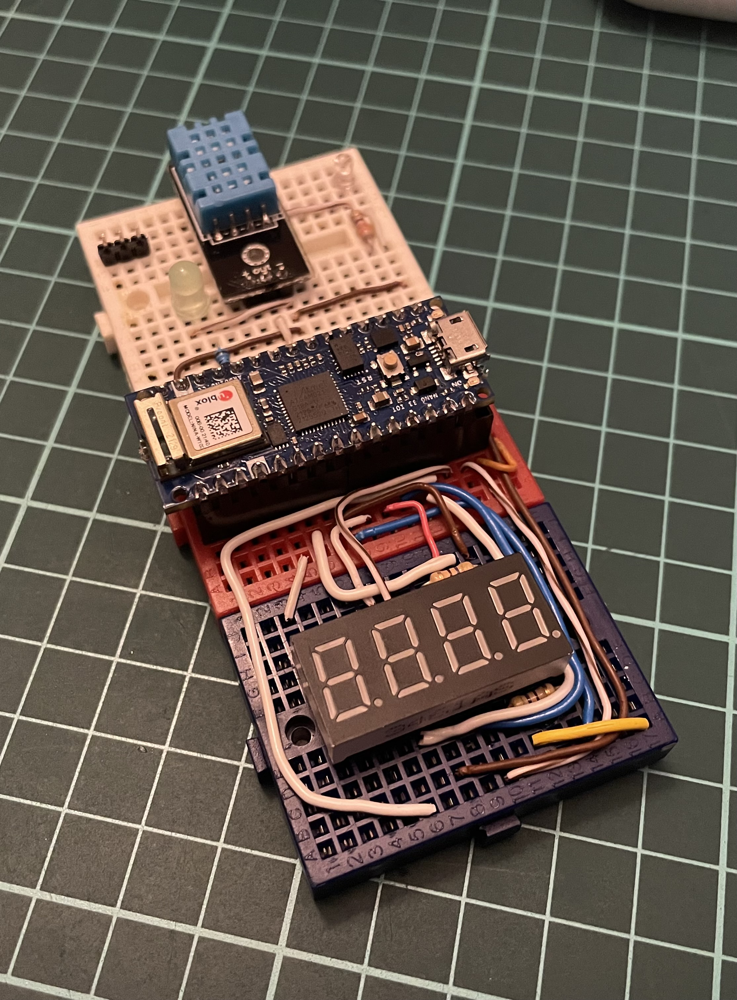
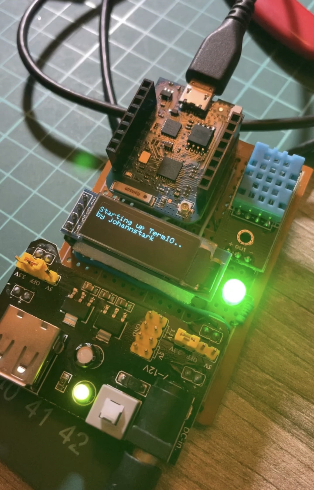
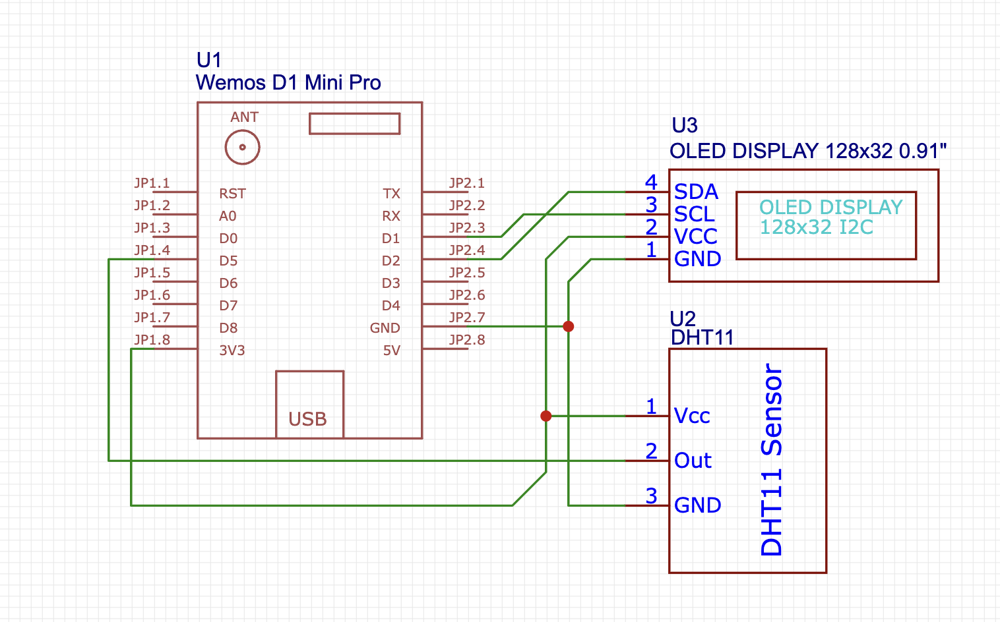

# TermIO

**TermIO** is a ***home-made*** indoor temperature and humidity device. It is a **DIY** project that uses a **DHT11** sensor to measure temperature and humidity and a **4 digit seven segment display/OLED Display** to show the data.

* Version 1 of the device is powered by the ***Arduino Nano 33 IoT*** + a ***DHT11 sensor*** + a ***4 digit seven segment display***.

* Version 2 of the device is powered by the ***ESP8266(Wemos D1 Mini Pro)*** + a ***DHT11 sensor*** + a ***0.91" OLED display***.

TermIO Ver. 1 vs Ver. 2

## Features

* Temperature and humidity measurement.
* It computes the Apparent temperature (feels like).
* Display of the temperature and humidity on 4 digit seven segment display/OLED Display.
* It uses the NANI WiFi/ESP8266 WiFi module to connect to the internet and send the data to a server/hub/etc. [WIP] :warning:
* Connects to [Homebridge](https://homebridge.io) with a [HTTP Webhook plugin](https://www.npmjs.com/package/homebridge-http-webhooks) to show the data on HomeKit. [WIP] :warning:

***

## Getting Started

1. Build the circuit using the [schematics (ClickMe)](#building-the-circuit) based on the board you are using. (Arduino Nano 33 or ESP8266)
2. Clone this repository and open it with the PlatformIO IDE. Be aware to open the right folder depending on your development board.

    `git clone https://github.com/johannstark/TermIO.git`

3. Create `include/secret.h` header file to contain the WiFi credentials to be use by TermIO.
4. Build and upload the code to your development board using PlatformIO.

***

## Hardware

TermIO has 2 working versions:

### Arduino Nano 33 IoT

TermIO V1 works with the [Arduino Nano 33 IoT](https://store-usa.arduino.cc/products/arduino-nano-33-iot) that Features:

* Built-in WiFi and Low Energy Bluetooth.
* It is powered by a 32 bit **Arm® Cortex®-M0 processor**.
* Works with the Arduino Framework.
* It has a **Micro USB** port for power and programming.
* 3.3V logic level.

We use a [DHT11](https://www.adafruit.com/product/386) sensor for measuring temperature and humidity.

Displaying the temperature is done with a generic 4 digit seven segment display.

### Wemos D1 Mini Pro

We made a second version of the device using a ESP8266 chip onboard of the Wemos D1 Mini Pro. This board features:

* A ESP8266 WiFi chip with a Tensilica L106 32-bit RISC processor.
* Built-in antenna
* Work with Arduino, MicroPython and NodeMCU frameworks.
* Also 3.3V logic level.

***

## Building the circuit

Here are the main schematics to connect the components to the development board. I suggest to power the entire circuit with a [breadboard power supply](https://www.amazon.com/-/es/ALAMSCN-alimentación-tablero-soldadura-bater%C3%ADa/dp/B08JYPMCZY/ref=sr_1_3?keywords=breadboard+power+supply+module&qid=1672180516&sr=8-3) that delivers both 5V and 3.3V from a 12V socket or USB cable.

**:warning: POWER THE CIRCUIT WITH 3.3V :warning:**

### BOM (Bills of Materials)

* x1 DHT11 sensor
* x1 Breadboard power supply module (or any way to power 3.3V)
* x1 micro USB cable (to upload your code from the PC!)

For the Arduino Nano version, you will also need:

* x1 Seven segment display (in this case a 3461AS display)
* x6 330Ω resistors
* x2 LEDs (any color would be ok)

or if you go with the Wemos board:

* x1 0.91" OLED display
* x1 Wemos D1 Mini Pro

### Arduino Nano schematics

### D1 Mini Pro schematics

## Software

C++ Code built with the amazing [PlatformIO IDE](https://platformio.org/) using the Arduino framework for both Nano 33 IoT and the ESP 8266, via VS Code.

Libraries used in the project:

* [Adafruit DHT Sensor Library](https://registry.platformio.org/libraries/adafruit/DHT%20sensor%20library)
* [Adafruit Unified Sensor](https://registry.platformio.org/libraries/adafruit/Adafruit%20Unified%20Sensor) (Dependency of the DHT Sensor Library)
* [SevSeg by Dean Reading](https://registry.platformio.org/libraries/Dean%20Reading/SevSeg) (Arduino Seven segment display library)
* [Adafruit's GFX and SSD1306 libraries](https://registry.platformio.org/libraries/adafruit/Adafruit%20GFX%20Library) (OLED Display library)

## License

This project is licensed under the MIT License - see the [LICENSE](LICENSE) file for details.

***

***Built with Love :heart: in Colombia :colombia:***
